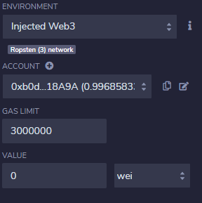
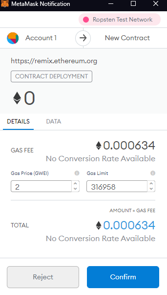
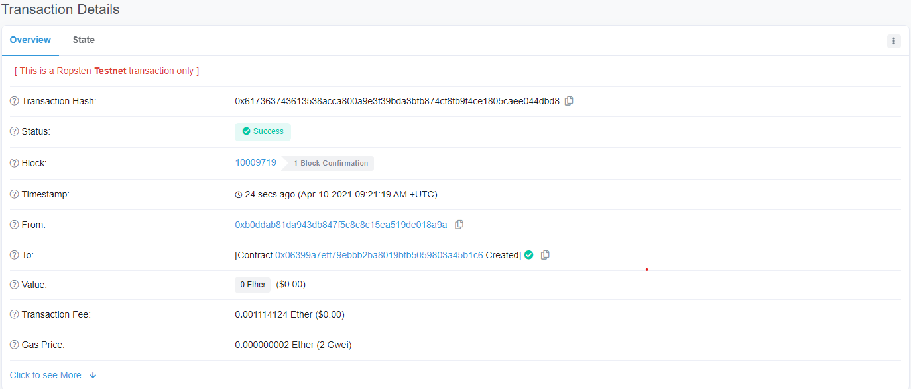
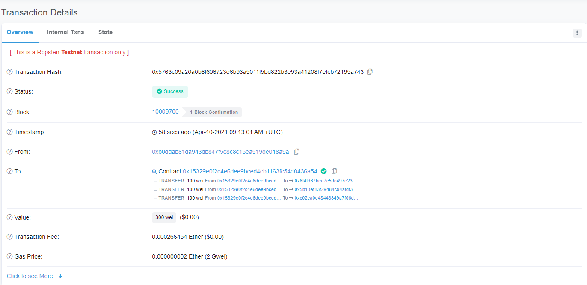
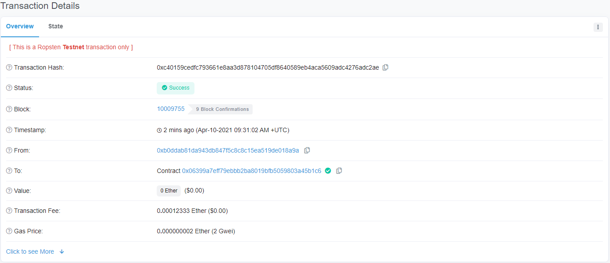
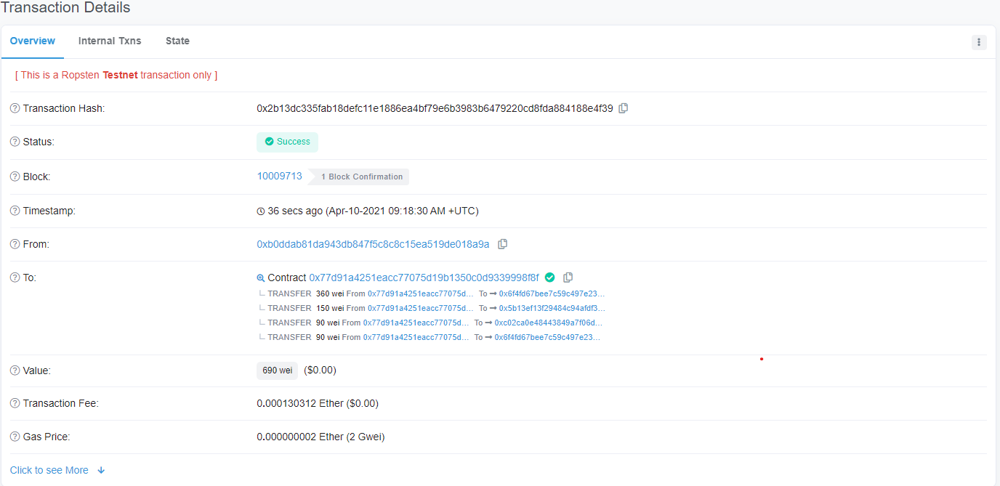
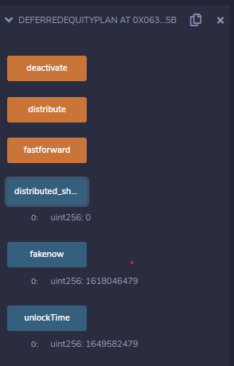
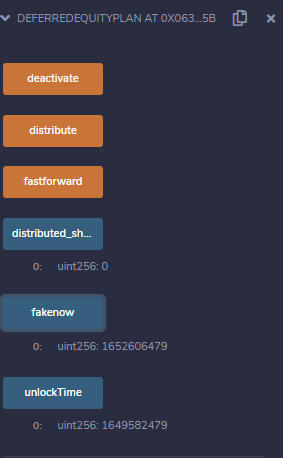
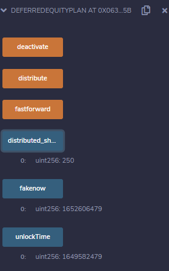

# Payment Plans with Smart Contracts

## Background

This is to program smart contracts with Solidity: creating a few `ProfitSplitter` contracts. These contracts will do several things to automate some company finances to make everyone's lives easier, increase transparency, and make accouting and auditing practically automatic:

* Pay the Associate-level employees quickly and easily.

* Distribute profits to different tiers of employees.

* Distribute company shares for employees in a "deferred equity incentive plan" automatically.

However, before lanuching a project on the Ethereum blockchain (or before make changes onto the blockchain), deploying to an Ethereum Test Network or "testnet", which simulates Ethereum, gives developers, the community, and users a chance to test the codes implemented before real assets are involved.

[Ganache](https://www.trufflesuite.com/ganache) is such a "testnet" that enables us to create a private Ethereum blockchain on the local machine for running tests, executing commands, and inspecting its state while controlling how the chain operates.

## Files

* [`AssociateProfitSplitter.sol`](/AssociateProfitSplitter.sol) -- Level 1 code.

* [`TieredProfitSplitter.sol`](/TieredProfitSplitter.sol) -- Level 2 code.

* [`DeferredEquityPlan.sol`](/DeferredEquityPlan.sol) -- Level 3 code.

There are 3 levels of difficulty, with each contract increasing in complexity and capability. 

* **Level One** is an `AssociateProfitSplitter` contract. This will accept Ether into the contract and divide the Ether evenly among the associate level employees. This will allow the Human Resources department to pay employees quickly and efficiently.

* **Level Two** is a `TieredProfitSplitter` that will distribute different percentages of incoming Ether to employees at different tiers/levels. For example, the CEO gets paid 60%, CTO 25%, and Bob gets 15%.

* **Level Three** is a `DeferredEquityPlan` that models traditional company stock plans. This contract will automatically manage 1000 shares with an annual distribution of 250 over 4 years for a single employee.

### Level One: The `AssociateProfitSplitter` Contract
All contracts were tested on the loaclhost network on ganache but were also deployed on to the Ethereum Ropsten network (as for each of the other contracts) as seen below:

Confirmations of deplpoyment as follows: 

Using the deposit function, 300 wei was depostied into the contract and transferred to the three employee address, split equally.

### Level Two: The `TieredProfitSplitter` Contract

In this contract, rather than splitting the profits between Associate-level employees, will calculate rudimentary percentages for different tiers of employees (CEO, CTO, and Bob).

Confirmation of deployment:

690 wei was deposited into the contact and transferred to the different addresses following the aforementioned tiered payment plan, with the remainder of the deposit returning to the CEO.

### Level Three: The `DeferredEquityPlan` Contract

In this contract, there will be managing an employee's "deferred equity incentive plan" in which 1000 shares will be distributed over 4 years to the employee. We won't need to work with Ether in this contract, but we will be storing and setting amounts that represent the number of distributed shares the employee owns and enforcing the vetting periods automatically.

This time the contract was deployed with just one employee address constructed:

This gave us the current fakenow timestamp as well as the unlock_time timestamp:

The fastforward() function was used to increase the fakenow time until it was greater than the unlock time, looking like this:

Until finally, the distribute fuunction could be used to distrubite the first round of shares, looking like this:

Overall, each contract worked as intended and every employee was happy. :D

